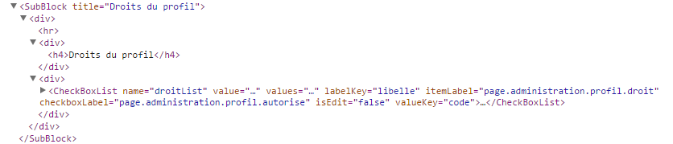

# Ecrire un composant React

## Présentation

L'écriture de composant React doit suivre des règles qui permettent d'avoir des composants documentés, robustes, débuggables.

## Règles de codage

### Définir le display-name

La propriété `displayName` doit être définie sur le composant, avec le nom du composant en PascalCase.

```javascript
module.exports = React.createClass({
    displayName: 'SubBlock'
    /* ... */
});
```

Ce libellé est utilisé par le plugin React de Chrome pour afficher l'arborescence des composants React.



### Contractualisation des props

Les props doivent être contractualisées à l'aide de la propriété `propTypes`.

Cela permet :
  * de documenter le contrat du composant
  * d'avoir des contrôles automatiques quand on utilise le composant

On utilse l'objet `Focus.component.types` qui est un wrapper autour des Types de React.

```javascript
let type = Focus.component.types;
module.exports = React.createClass({
    propTypes: {
        title: type('string', true), /* subblock title i18n key */
        children: type('object')
    },
    /* ... */
});

```
### Injecter les enfants

Si le composant est susceptible d'avoir des enfants, il faut les réinjecter.

```javascript
let type = Focus.component.types;
module.exports = React.createClass({
    /* ... */
    propTypes: {
        children: type('object')
    },
    render(){
        return (<div>
            <hr/>
            <!-- ... -->
            <div>
                {this.props.children}
            </div>
        </div>);
    }
});
```

Détail :
  * on définit children dans les props
  * on injecte les enfants avec `{this.props.children}`

### Autres

  * Annoter le composant avec un data-focus ?
  * Convention de nommage méthodes : préfixe _ ?
