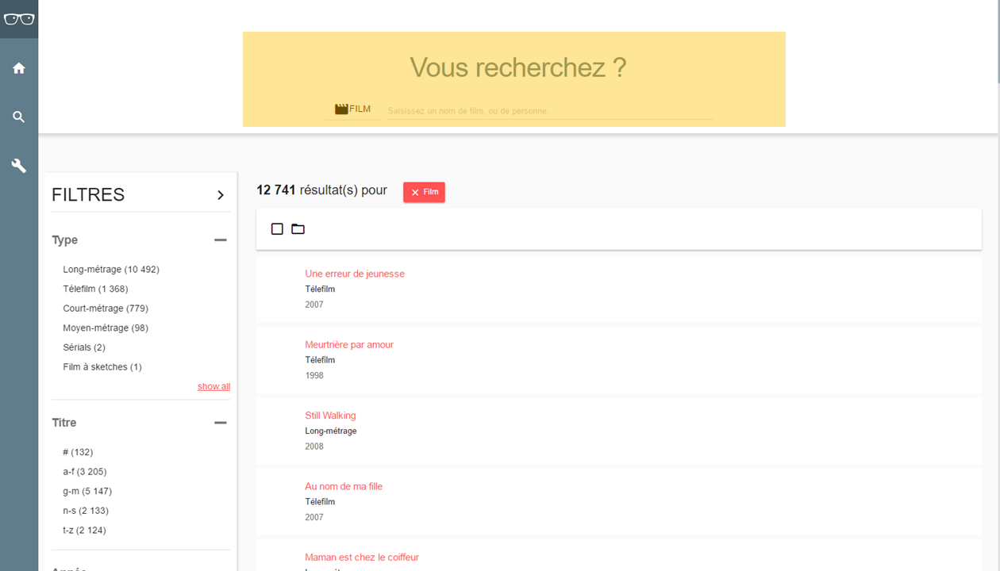

# La recherche avancée FOCUS ? comment l'implémenter ?

La recherche est un concept au centre des applications métiers, et donc au centre des concepts FOCUS.

Dans ce tutoriel, nous allons détailler pas à pas l'ensemble des étapes et des componsants FOCUS à utiliser, permettant d'accélérer les développements d'une page de recherche avancée.

## Anatomie d'une page de recherche

La recherche FOCUS reprend les grands principes de recherches issus du e-Commerce :
* Un champ unique de recherche "à la Google" (en haut, toujours visible et accesible en 1 clic)
* Une liste de résultats (triable, groupable) sur laquelle il est possible d'agir en masse (a droite)
* Des filtres prédéfénis sur forme de facettes (à gauche)


## Avant de commencer

> Un exemple concret d'implémentation de la recherche avancée a été rédigée par nos petites mimines : https://github.com/KleeGroup/focus-demo-app
>
> Si vous êtes sur le réseau interne, une démo online de la recherche avancée est disponible ici : http://focus-demo.dev.klee.lan.net/

## Que gère le composant FOCUS de recherche avancée ?

Le composant de recherche avancée gère automatiquement:
* La présentation graphique de tous les composants de la recherche avancée, selon la mise en page affichée au dessus
* L'affichage automatique
    * des facettes et valeurs (à gauche), fourni en réponse de l'appel du WS de recherche
    * de la liste de résultats au centre de l'écran
    * du nombre de résultats total pour la requête dans résumé (en haut de la liste)
* Les appels au service de recherche lors
    * de la modification d'un critère de recherche (scope ou input de recherche)
    * d'un clic sur une valeur de facette (à gauche)
    * d'un critère de filtre (dans la barre d'action)
    * d'un critère de grouping (dans la barre d'action)
* La (dé/)selection de toutes les valeurs de la liste de résultat
* Le store des données de recherche
* Les actions liés à la recherche

## Qu'est-ce que le composant FOCUS de recherche avancée ne gère pas ?

* L'appel aux WS de recherche
* L'affichage des lignes et des actions possibles sur une ligne
* Les actions en masse sur la liste
* L'export des résutlats au format EXCEL / PDF / ...
* La définition des axes de tri et grouping

## 1. Création du service de recherche

Le service de recherche définit dans votre SPA vous permettra de faire le lien avec les services de recherche que vous aurez définis côté Backend.

### Première étape : la configuration des URL

Définition la configuration de l'URL pour l'appel aux WS.

Vous devez normalement avoir définit côté serveur :
* 1 WS par entité recherché (par scope)
* 1 WS pour une recherche gobable (sur tous les scopes)

Cela signifie par exemple, que pour un écran de recherche avancée concernant 2 scopes (dans le cas de la démo : Les films et les personnes), vous devez avoir définit côté serveur les 3 webservices suivants :
* 1 WS pour le scope FILM
* 1 WS pour le scope PERSONNE
* 1 WS pour le scope TOUT

3 URL de recherche sont donc à prévoir dans la configuration : 1 URL par WS de recherche. Par exemple:
* `http://server/api/movies/search`
* `http://server/api/person/search`
* `http://server/api/common/search`

Définissons ensemble l'URL de recherche d'un film. Rendez-vous dans le répertoire `config/server/movies`. Ce fichier contient la configuration de toutes les WS utiles à la SPA, et qui concerne les films.

Dans le cas présent, les services suivants :
* `create` pour la création d'un fim,
* `load` pour le chargement des données d'un film,
* `update` pour la mise à jour des données d'un film.

Définissez-y une nouvelle entrée `search` de la manière suivante:

```javascript
import builder from 'focus-core/util/url/builder';
import {apiRoot} from './index';

const movieRoot = `${apiRoot}movies/`;

export default {
    create: builder(movieRoot, 'POST'),
    load: builder(movieRoot + '${id}', 'GET'),
    search: builder(movieRoot + 'search?listState.skip=${skip}&listState.sortDesc=${sortDesc}&listState.top=${top}', 'POST'),
    update: builder(movieRoot + '${id}', 'PUT')
};
```

Pour plus d'exemples : https://github.com/KleeGroup/focus-demo-app/tree/develop/app/config/server

### Seconde étape : la définition du service

Commençons par créer un ficher `search.js` qui contiendra toute la logique d'appel des WS de rechercher sur le serveur.

Le fichier peut contenir la structure suivante:

```javascript
export default {

    /**
     * Target search service call.
     * (This should the target : search service should be written this way.)
     *
     * @param  {object} config search call configuration.
     * @param  {string} scope  scope search
     * @return {object}        search response
     */
    _search(config, scope) {
        switch (scope) {
            case 'movie':
                //appelez ici le service de recherche de movie
            case 'person':
                //appelez ici le service de recherche d'une personne
            default:
                //appelez ici le service de recherche portant sur tous les scopes
        }
    },

    /**
    * Search with scope.
    * @param  {Object} AdvancedSearch config that launches the call of this service
    * @return {Promise}
    */
    scoped(config) {
        const {scope} = criteria;
        return this._search(config, scope);
    },

    /**
    * Search without scope.
    * @param  {Object} AdvancedSearch config that launches the call of this service
    * @return {Promise}
    */
    unscoped(config) {
        return this._search(config);
    }

};
```

Votre fichier doit contenir impérativement les services suivants:
* `scoped` qui sera appelé par le composant de recherche avancée pour toute requête au serveur concernant un scope en particulier : par exemple le scope FILM
* `unscoped` qui sera appelé par le composant de recherche avancée pour toute requête au serveur dont aucun scope n'est pas précisé (scope ALL)

L'important dans tout cela, c'est la méthode `search` qui exécutera les appels aux bons WS en fonction du scope.

Exemple d'implémentation d'un appel :
```javascript
import fetch from 'focus-core/network/fetch';

import moviesUrl from '../config/server/movies';

export default {


    /**
     * Target search service call.
     * (This should the target : search service should be written this way.)
     *
     * @param  {object} config search call configuration.
     * @param  {string} scope  scope search
     * @return {object}        search response
     */
    _search(config, scope) {
        switch (scope) {
            case 'movie':
                return fetch(moviesUrl.search(config));
            case 'person':
                return ...; //appelez ici le service de recherche d'une personne
            default:
                return ...; //appelez ici le service de recherche portant sur tous les scopes
        }
    },

    /**
    * Search with scope.
    * @param  {Object} AdvancedSearch config that launches the call of this service
    * @return {Promise}
    */
    scoped(config) {
        const {scope} = criteria;
        return this._search(config, scope);
    },
    /**
    * Search without scope.
    * @param  {Object} AdvancedSearch config that launches the call of this service
    * @return {Promise}
    */
    unscoped(config) {
        return this._search(config);
    }
};
```

Pour un exemple complet, tout est ici : https://github.com/KleeGroup/focus-demo-app/blob/develop/app/services/search.js


## 2. Création du repértoire de la vue

Commençons par créer un dossier pour regrouper l'ensemble des vues relatives à la recherche dans le projet, dans le répertoire `views`.

La manière dont vous organisez votre dossier vous incombe. Cependant, nous vous conseillons très fortement cette organisation. Regroupez tous vos écrans de recherche dans le répertoire `views/search`, qui du coup contiendra :
    * `views/search/advanced` qui contiendra les développements spécifiques à la recherche avancée
    * `views/search/lines` qui contiendra l'implémentation du rendu des lignes pour la recherche (avancée et rapide)
    * `views/search/quick` qui contiendra les développements spécifiques à la [recherche rapide](recherche-rapide.md)

## 3. Création de la vue

Dans le répertoire `views/search/advanced`, créez un in fichier `index.jsx` qui constituera la vue Recherche Avancée.

Le contenu de ce fichier est assez simple puisqu'il consiste à créer un composant React qui intègre:
* Le composant de recherche avancée standard de FOCUS
* La configuration de la recherche avancée (tout cela est décrit dans la section suivante)

```javascript
import React, {PropTypes} from 'react';

// web components
import {component as AdvancedSearch} from 'focus-components/page/search/advanced-search';

//line mapping
import {configuration} from './configuration';

function AdvancedSearchView() {
    return <AdvancedSearch {...configuration} />;
};

AdvancedSearchView.displayName = 'AdvancedSearch';
export default AdvancedSearchView;
```

La configuration définit au final un simple objet Javascript, dont les proriétés correspondent aux "props" du composant React `AdvancedSearch`.
Il est déclaré via l'annotation `{...configuration}` qui a pour effet d'éclater les propriétés de l'objet dans les props du composant `AdvancedSearch`.

Un exemple très concret ? c'est par ici : https://github.com/KleeGroup/focus-demo-app/tree/develop/app/views/search/advanced

## 4. Création de la configuration

La configuration contient tout le paramétrage qui est fourni au composant de recherche avancée. Nous vous conseillons de placer fichier dans le répertoire `views/search/advanced/configuration/index.js`.

Voici un exemple de ce fichier:
```javascript
// seearch services
import service from '../../../../services/search';

//search configurations
import cartridgeConfiguration from './cartridge';
import lineMapper from '../../lines/mapper';
import onLineClick from '../../lines/line-click';
import {scopesConfig} from '../../../../config/scopes';

export const configuration = {
    onLineClick,
    isSelection: true,
    cartridgeConfiguration,
    service,
    lineComponentMapper: lineMapper,
    groupMaxRows: 5,
    scopesConfig: scopesConfig
};
```

* La propriété `onLineClick` définit le comportement à adopter lors d'un clic sur une ligne de résultat.
* La propriété `isSelection` définit le caractère sélectionnable en masse des résultats de la liste (à coupler avec des actions à en masse)
* La propriété `cartridgeConfiguration` définit la configuration du cartouche pour la vue recherche avancée, et notamment les composants Scope et Input qui permettent de lancer la recherche
* La propriété `service` définit le service de recherche qui sera lancé lors des différentes actions de recherche sur la vue. Cela correspond bien sur au service que vous avez définit juste avant...
* La propriété `lineComponentMapper` definit la façon dont les lignes doivent se rendre (en fonction de leur type)
* La propriété `groupMaxRows` "est censé" définir le nombre d'éléments affichér par groupe. Je dis "censé" car pour le moment cela ne fonctionne pas. Mais une issue est ouverte à ce sujet !
* La propriété `scopesConfig` est un fichier de mapping qui a pour objectif de mapper les valeurs des scopes renvoyées par le serveur avec les valeurs des scopes définies sur dans votre application JS.

--> parler de la surcharge GroupComponent (attention au scope mapping dans le composant). S'inspirer du composant fourni par défaut par FOCUS.


## 5. Définition de la configuration de l'entête

A cette étape, vous aurez forcément envie d'injecter les champs critères de lancement dans votre cartouche, principalement pour tester:
* l'appel des services de recherche implémentés
* la mise à jour des données dans les stores de recherche
* et puis tout simplement qu'il se passe quelque chose !

Focus facilite la mise en place du cartouche contenant ces critères de lancement, sous la forme suivante (en jaune):


Pour ce faire, il suffit juste de définir la configuration de ce cartouche comme ceci:
```javascript
import CartridgePageSearch from 'focus-components/page/search/search-header/cartridge';
import SummaryPageSearch from 'focus-components/page/search/search-header/summary';
import service from '../../../../services/search';

export default function cartridgeConfiguration() {
    return {
        summary: {
            component: SummaryPageSearch,
            props: { service }
        },
        cartridge: {
            component: CartridgePageSearch,
            props: { service }
        },
        actions: {
            primary: [],
            secondary: []
        }
    };
}
```

Deux composants sont fournit par FOCUS :
* `focus-components/page/search/search-header/cartridge` : affiche le composant pour le mode déplié du cartouche. Il gère également l'affichage du titre.
* `focus-components/page/search/search-header/summary` : affiche le composant pour le mode replié du cartouche

L'avantage d'utiliser ces composant, c'est que toute la logique d'écoute du store de recherche avancée, ainsi que que sa mise à sur la partie critère de recherche est déja implémentée. Les composants s'utilisent tels quel.

Le service de recherche est passé en props des 2 composants pour qu'ils consomment ces services lors d'une action de l'utilisateur.

Enfin, comme pour toute configuration d'entête FOCUS, vous avez la possibilité de définir les actions propres à votre écran.

Bien sûr, cette configuration est la configuration standard FOCUS. Vous avez également possibilité de définir vos propres composants / critères de lancement. Mais autant rester dans le standard...

## 6. Création du Line Mapper

Le `lineComponentMapper` est la configuration qui décrit le mapping de rendu d'une ligne de la recherche en fonction en fonction de la recherche. Grâce à ce mapper, la liste de résultats de recherche saura quel rendu adopter en fonction du type de donnée passée.

Vous pouvez le définir dans le répertoire `views/search/lines`, sous le nom `mapper.js`:

```javascript
import DefaultLine from './line';
import MovieLine from './movie';
import PersonLine from './person';

export default function lineComponentMapper(groupKey) {
    switch (groupKey) {
        case 'movie': return MovieLine;
        case 'person': return PersonLine;
        default: return DefaultLine;
    }
}
```

Décrivez ensuite le composant de rendu de chaque ligne. Par exemple, celui d'un film (`views/search/lines/movie.js`):

```javascript
//libraries
import React, {PropTypes} from 'react';
import {mixin as lineMixin} from 'focus-components/list/selection/line'

export default React.createClass({
    displayName: 'MovieLine',
    mixins: [lineMixin],
    definitionPath: 'movie',
    propTypes: {
        data: PropTypes.object.isRequired
    },
    renderLineContent() {
        const {data} = this.props;
        const {code} = data;
        return (
            <div key={code} data-demo='movie-line'>
                <div className='level1'>{this.textFor('title')}</div>
                <div className='level2'>{this.textFor('movieType')}</div>
                <div className='level3'>{this.textFor('productionYear')}</div>
            </div>
        );
    }
});
```

Le composant que vous venez d'écrire intègre le mixin `focus-components/list/selection/line`, qui va offrir à la ligne l'ensemble des comportements nécessaires à l'affichage d'actions unitaires, et à la sélection de l'objet dans une liste.

Le mixin définit aussi les props d'entrée du composant ligne. Un composant ligne se voit toujours attribué la props `data` qui correspond aux données de la ligne qui pourront être affichées.

Le mixin débraye le rendu du contenu spécifique à la ligne dans la fonction `renderLineContent`. Vous n'avez pas à implémenter la gestion de la selection, ni le mécanisme d'actions sur la ligne, le composant le fait tout seul.

--> parler de la définition des actions sur la ligne.

Bien sûr, vous affichez un élément d'une liste, et React a besoin d'une clé pour identifier de manière unique l'élément de la ligne. N'oubliez pas définir la clé de la ligne via l'attribut `key`. Vous éviterez quelques warning dans votre console, et de potentiels bugs pour la suite...


## 7. Définition du comportement au click sur une ligne

Le comportement au click sur une ligne se définit également dans une fichier de mapping, par exemple dans le fichier `views/search/lines/line-click.js`.
Bien sûr, le comportement n'est pas le même en fonction du type de la ligne cliquée. Par exemple, si le type est movie, bien souvent il est souhaité redirigier l'utilisateur vers la page de détail movie. Si le type est film, vers la page de détail d'un film. Mais vous pouvez aussi ici définir l'ouverture d'un panneau latéral glissant dans la droite.

L'exemple ci-dessous illustre la définition d'un fichier de mapping des comportements au clic sur une ligne:

```javascript
import history from 'focus-core/history';

export default function onLineClick(data) {
    let url = '#';
    const {code, type} = data;
    if('movie' === type) {
        url = `#movies/${code}`;
    }
    if('person' === type) {
        url = `#persons/${code}`;
    }
    history.navigate(url, true);
    window.scrollTo(0, 0);
}
```

`history` est importé de `focus-core` pour gérer la navigation.

Bien souvent, dans l'usage d'un écran de recherche, l'utilisateur scrolle pour accéder à l'entité qu'il recherche. Dans la logique d'une SPA (une seule page), il est donc souvent intéressant de remonter l'ascenseur en haut de la page lors d'une navigation. Dans le cas contraire, la nouvelle page affichée est positionnée au niveau du scroll courant. La position du scroll n'est pas modifiée automatiquement par le système, mais à la demande du développement. C'est pourquoi vous voyez apparaitre un `window.scrollTo(0,0)` à la suite de la navigation.

# L'interface de ma recherche présentant les résultats groupés est différent du template
