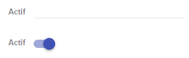

# Comment surcharger un champ par défaut du formulaire ?

Le formulaire propose un rendu par défaut des composants de saisie (input, select, radio, ...).
Vous avez besoin de surchager un composant par défaut ? Comment faire ?

Ce tuto vous explique tout.

## Qui gère le rendu par défaut ?

Le code composant `field` est ici : https://github.com/KleeGroup/focus-components/blob/develop/src/common/field/index.js

Vous n'avez cependant jamais besoin de l'utiliser en temps que tel. A la place, vous utilisez les fonctions mises à disposition par le `FormMixin`, et notamment la fonction `fieldFor`. Elle porte toute l'intelligence de rendu dont la mécanique est détaillée ici : https://github.com/KleeGroup/focus-components/blob/develop/src/common/field/mixin/built-in-components.js

## Prenons un exemple concret

Prenons par exemple ce formulaire:


Le code correspondant à cette vue est le suivant :
```javascript
//librairies
import React, {PropTypes} from 'react';

// web components
import Panel from 'focus-components/components/panel';
import {mixin as formPreset} from 'focus-components/common/form';

//stores & actions
import contactStore from '../../../stores/contact';
import {action} from '../../../action/contact';

export default React.createClass({
    displayName: 'ContactForm',
    propTypes: {
        id: PropTypes.number.isRequired
    },
    mixins: [formPreset],
    stores: [{store: contactStore, properties: ['contact']}],
    definitionPath: 'contact',
    action: action

    /**
    * Render content form.
    * @return {ReactDOMNode} node REACT
    */
    renderContent() {
        return (
            <Panel actions={this._renderActions} title="Fiche de l'utilisateur">
                {this.fieldFor('firstName')}
                {this.fieldFor('lastName')}
                {this.fieldFor('isActif')}
            </Panel>
        );
    }
});
```

Je veux surcharger le composant `input` pour le remplacer pour remplacer par un `toggle` :



## Et alors ? Comment je fais ?

Pour afficher le `field`, et ainsi rendre son composant de saisie, les données suivantes sont combinées et passées en props du `fieldFor` par le Form FOCUS :

* les domaines que vous avez définis
* les entités que vous avez définies

Dans notre exemple, pour les domaines :  
```javascript
const domain = {
    DO_TEXT: {
        type: 'text',
        validator: [{
            type: 'string',
            options: {
                maxLength: 50
            }
        }]
    },
    DO_OUI_NON: {
        type: 'text'
    }
};
```

Dans notre exemple, pour les entités :
```javascript
const entities = {
    contact: {
        firstName: {
            domain: 'DO_TEXT',
            required: false,
            validator: [{options: {translationKey: 'entityContactValidation.test'}, type: 'function', value: data => {
                return data.length <= 3 ? false : true;
            }}]
        },
        lastName: {
            domain: 'DO_TEXT',
            required: true
        },
        isActif: {
            domain: 'DO_OUI_NON'
        }
    }
```

Pour modifier le composant qui sera rendu par le form pour le champ `isActif`, il y a donc 2 solutions :
* en modifiant la définition du domaine `DO_OUI_NON`. Mais attention, cela modifiera le composant rendu pour tous les champs qui portent le domaine `DO_OUI_NON`
* en modifiant la définition de l'entité et du champ `isActif`. Cela modifiera le rendu uniquement pour ce champ

### Par exemple :

Le domaine `DO_OUI_NON` :

```javascript
    DO_OUI_NON: {
        type: 'text'
    }
```
devient

```javascript
    import Toggle from 'focus-components/components/input/toggle';

    DO_OUI_NON: {
        InputComponent: Toggle
    }
```

## Un peu plus loin dans la surcharge...

Si vous souhaitez customiser les valeurs de votre domaine, comme ceci :


Vous pouvez aussi écrire ceci :

```javascript
    import SelectRadio from 'focus-components/components/input/select-radio';

    DO_OUI_NON_RIEN : {
        SelectComponent: SelectRadio,
        refContainer: {yesNoNothingList: [{code: true, label: 'select.yes'}, {code: false, label: 'select.no'}, {code: null, label: 'select.dontknow'}]},
        listName: 'yesNoNothingList',
        formatter: i18n.t
    }
```

## Qu'est-il possible de surcharger ?

Les différentes propriétés réglables sont les suivantes:
- `DisplayComponent` surcharge le composant de display.
- `FieldComponent` surcharger le composant de field par défaut (utilisation rare)
- `formatter` définit une fonction de formatage qui sera appliqué au rendu de la valeur
- `InputComponent` surcharge l'input
- `InputLabelComponent` surcharge le composant Field mais uniquement dans le cas d'une checkbox ou d'un composant input embarqué dans le label
- `isRequired` définit si une propriété est requise ou non
- `SelectComponent` surcharge le select
- `TextComponent` surcharge du composant de rendu textuel
- `unformatter` définit la fonction pour reconstruire la donnée à partir de la valeur saisie dans l'input
- `validator` définit la fonction de validation de la données saisie. Cette fonction doit renvoyer `true` si valide et le message d'erreur si non valide.

## Depuis le `fieldFor` lui-même

Sachez qu'il est également possible de surcharger toutes ces props en les déclarant directement sur le `fieldFor`.

Par exemple :
```javascript
    {this.fieldFor('isActif', {InputComponent: Toggle})
```
