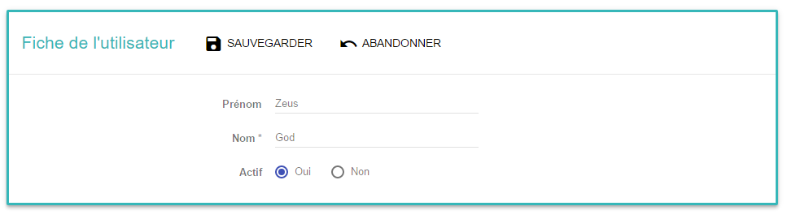
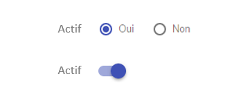

# Comment surcharger un composant par défaut du formulaire ?

Le formulaire propose un rendu par défaut des composants de saisie (input, select, radio, ...).
Vous avez besoin de surchager un composant par défaut ? Comment faire ?

Ce tuto vous explique tout.

## Qui gère le rendu par défaut ?

Le `fieldFor` que vous posez dans votre formulaire porte toute l'intelligence de rendu. La mécanique de rendu est ici : https://github.com/KleeGroup/focus-components/blob/develop/src/common/field/mixin/built-in-components.js

## Et alors ? quelle est la solution ?

Prenons par exemple ce formulaire:


Le code correspondant à cette vue est le suivant :
```javascript
//librairies
import React, {PropTypes} from 'react';

// web components
import Panel from 'focus-components/components/panel';
import {mixin as formPreset} from 'focus-components/common/form';

//stores & actions
import contactStore from '../../../stores/contact';
import {action} from '../../../action/contact';

export default React.createClass({
    displayName: 'ContactForm',
    propTypes: {
        id: PropTypes.number.isRequired
    },
    mixins: [formPreset],
    stores: [{store: contactStore, properties: ['contact']}],
    definitionPath: 'contact',
    action: action

    /**
    * Render content form.
    * @return {ReactDOMNode} node REACT
    */
    renderContent() {
        return (
            <Panel actions={this._renderActions} title="Fiche de l'utilisateur">
                {this.fieldFor('firstName')}
                {this.fieldFor('lastName')}
                {this.fieldFor('actif')}
            </Panel>
        );
    }
});
```

Je veux surcharger le rendu du booléan pour remplacer les radios en toggle :


Pour se rendre, et ainsi rendre son composant de saisie, les données suivantes sont combinées et passées en props du fieldFor `fieldFor` par le Form FOCUS:
    * des domaines que vous avez définis, par exemple :
```javascript
const domain = {
    DO_TEXT: {
        style: 'do_text',
        type: 'text'
    },
    DO_OUI_NON: {
        SelectComponent: FocusComponents.common.select.radio.component,
        refContainer: {yesNoList: [{code: true, label: 'select.yes'}, {code: false, label: 'select.no'}]},
        listName: 'yesNoList',
        formatter: i18n.t
    }
};
```
    * des entités que vous avez définies :
```javascript
const entities = {
    contact: {
        firstName: {
            domain: 'DO_TEXT',
            required: false,
            validator: [{options: {translationKey: 'entityContactValidation.test'}, type: 'function', value: data => {
                return data.length <= 3 ? false : true;
            }}]
        },
        lastName: {
            domain: 'DO_TEXT',
            required: true
        },
        isCool: {
            domain: 'DO_OUI_NON'
        }
    }
```
